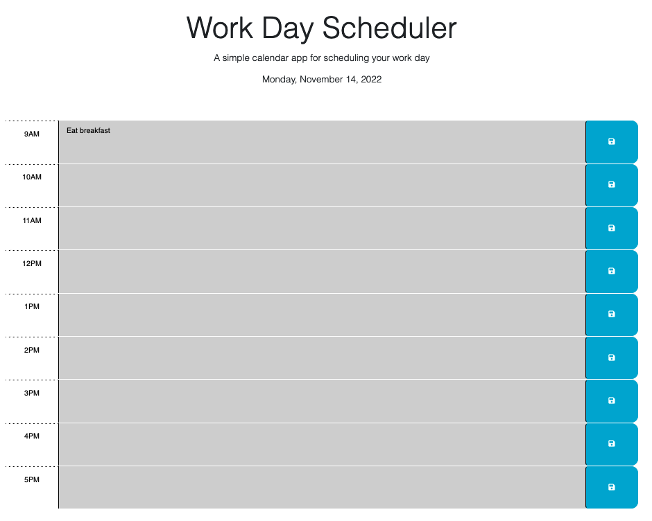
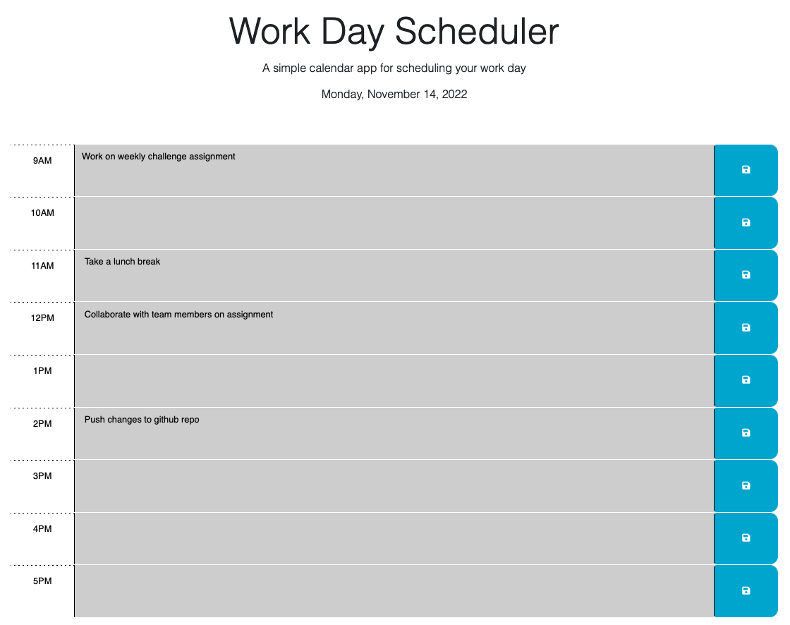

 <h1 align="center">Work Day Scheduler</h1>

---

### The purpose of this project was to create a daily planner to help effectively manage time.

---

This daily planner features the Day.js library along with dynamically updating the HTML and CSS files with the jQuery framework.

The daily planner also utilizes the users local storage by saving the events inputted by the user. So if the page is every refreshed the user will still be able to access their planned events.

---

Below are a some examples of the daily planner in action.

---

